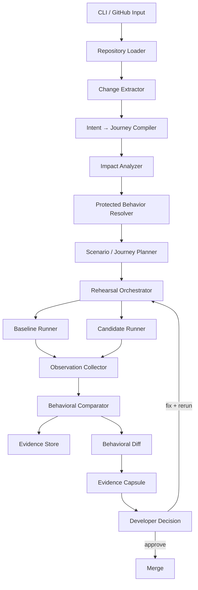

# Change Rehearsal — Technical Architecture & Product Architecture v2

## 1. Technical Objective

Prove one complete workflow:

```text
Repository
→ Change
→ Requirement
→ Intent → Journey
→ Impact
→ Protected Behavior
→ Scenario
→ Baseline Replay
→ Candidate Replay
→ Behavioral Diff
→ Evidence Capsule
→ Developer Action
```

Every behavioral verdict must be backed by reproducible evidence.

---

## 2. Architecture Overview



---

## 3. Components

| Component | Responsibility |
|---|---|
| Repository Loader | Opens target repository at known refs and validates MVP support. |
| Change Extractor | Produces structured diff: files, hunks, symbols, base/candidate refs. |
| Intent → Journey Compiler | Converts requirement/acceptance criteria into expected behavior plus candidate journeys. |
| Impact Analyzer | Finds affected files, symbols, services, APIs, and known workflows. |
| Protected Behavior Resolver | Produces protected behaviors from tests, contracts, inference, and explicit developer confirmation. |
| Journey/Scenario Planner | Converts journeys into deterministic executable scenarios. |
| Rehearsal Orchestrator | Runs baseline and candidate in isolated environments and coordinates evidence collection. |
| Baseline Runner | Executes the pre-change version. |
| Candidate Runner | Executes the post-change version. |
| Observation Collector | Captures normalized outputs, state snapshots, traces, and logs. |
| Behavioral Comparator | Compares baseline and candidate while filtering known noise. |
| Evidence Store | Stores observations, diffs, scenario definitions, and metadata per run. |
| Behavioral Diff | Produces workflow-level verdicts. |
| Evidence Capsule | Packages a complete rehearsal result for humans and machines. |
| Repair Loop | Re-runs only affected scenarios after a fix. |

---

## 4. Intent → Journey Compiler

Input:

```text
Requirement:
"Add caching to Product API to improve response time."
```

Output:

```text
Expected change:
Product API response path gains caching

Candidate journeys:
- Product browsing
- Product → Inventory
- Product → Cart
- Product → Checkout

Protected behaviors:
- Inventory freshness
- Product price accuracy
```

The compiler may use LLM reasoning, but its output must become a structured artifact before execution.

---

## 5. Impact Analysis

### Within a service

Use language-appropriate call/import graph information.

### Across services

For the MVP, use a developer-declared/config-driven service map.

Example:

```yaml
services:
  product:
    depends_on:
      - inventory
      - pricing
      - cart
```

Automatic cross-service discovery is future scope.

---

## 6. Journey Model

A journey represents a meaningful workflow, not a single assertion.

Example:

```text
Journey: inventory-visibility-after-update

1. Update inventory to 3
2. Read product
3. Compare displayed stock
```

A journey may contain one or many executable scenarios.

The MVP should keep journeys deterministic.

---

## 7. Protected Behavior Resolution

Sources, highest to lowest confidence:

```text
confirmed
> test-derived
> contract-derived
> inferred
```

Every protected behavior carries its source/confidence through to the report.

---

## 8. Rehearsal Execution

Baseline and candidate must be isolated.

```text
                 Rehearsal
                    │
          ┌─────────┴─────────┐
          ▼                   ▼
      BASELINE             CANDIDATE
      container            container
          │                   │
          ▼                   ▼
      scenario              scenario
          │                   │
          └─────────┬─────────┘
                    ▼
              observations
```

For the hackathon MVP:

- deterministic seed data
- fixed/mocked clocks where needed
- no live third-party dependencies
- disposable local containers or tightly isolated local processes

---

## 9. Observation Model

Capture only what matters for the scenario:

```text
HTTP status
HTTP body
selected headers
DB state snapshot
stdout/stderr
assertion / trace information
```

Normalize known noise:

```text
timestamps
request IDs
auto-increment IDs
random trace IDs
```

---

## 10. Behavioral Verdicts

### Preserved

```text
Baseline = Candidate
```

### Intentional Change

```text
Baseline ≠ Candidate
AND
requirement indicates the difference is expected
```

### Regression

```text
Baseline = expected/protected behavior
AND
Candidate ≠ expected/protected behavior
AND
change is not justified by the requirement
```

### Potentially Affected / Not Exercised

The workflow was identified as relevant but no executable scenario proved it.

The product must surface this honestly rather than converting a coverage gap into a false green.

---

## 11. Evidence Capsule

A capsule contains:

```text
change metadata
requirement
journey definitions
protected behaviors
scenario definitions
baseline observations
candidate observations
behavioral diffs
reproduction steps
affected code references
recommendation
```

Machine-readable:

```text
rehearsal-report.json
```

Human-readable:

```text
rehearsal-report.md
```

---

## 12. Repair Loop

```text
Regression
   ↓
Developer fixes code
   ↓
Re-run affected journeys only
   ↓
Compare again
   ↓
Resolved?
 ┌──┴──┐
Yes    No
 ↓      ↓
Ready  Continue
```

This keeps iteration fast.

---

## 13. GitHub Integration

MVP:

```text
change-rehearsal run --pr <number>
```

The CLI reads the PR diff and posts the rendered Behavioral Diff as a comment.

A full GitHub App is not part of MVP.

A GitHub Action remains a stretch/future layer if time permits.

---

## 14. CLI Contract

Conceptual commands:

```bash
change-rehearsal run \
  --repo <path> \
  --base <ref> \
  --candidate <ref> \
  --requirement "<text>"
```

```bash
change-rehearsal rerun \
  --run-id <id> \
  --commit <ref>
```

```bash
change-rehearsal show \
  --run-id <id>
```

```bash
change-rehearsal show \
  --run-id <id> \
  --evidence <scenario-id>
```

Exact syntax can change during implementation.

---

## 15. Functional Requirements

- FR1: Accept repository + base/candidate refs or PR input.
- FR2: Accept optional requirement/acceptance criteria.
- FR3: Compile requirement into candidate journeys / expected changes.
- FR4: Produce protected behavior records with source/confidence.
- FR5: Generate deterministic executable scenarios.
- FR6: Run scenarios against baseline and candidate.
- FR7: Capture normalized observations and evidence.
- FR8: Produce Behavioral Diff.
- FR9: Export Evidence Capsule.
- FR10: Re-run only affected scenarios after a fix.
- FR11: Optionally post results to a GitHub PR.

---

## 16. Non-Functional Requirements

- Deterministic for the MVP.
- Baseline/candidate isolation.
- Traceability from every verdict to evidence.
- Demo-friendly runtime for ShopFlow.
- Transparent uncertainty.
- Script-friendly CLI and JSON output.

---

## 17. Failure Modes

### Build failure

Report separately from behavioral regression.

### Scenario generation failure

Mark the behavior as not exercised.

### Inference-only protected behavior

Show confidence/source clearly and require developer review for strong claims.

### Cross-service impact unavailable

Report that cross-service analysis is limited by the configured service map.

---

## 18. Acceptance Criteria

### Required demo case

ShopFlow caching change produces:

```text
Journey:
Product → Inventory

Verdict:
❌ Regression

Evidence:
Baseline and candidate observations
```

### Required control case

A safe change produces:

```text
Protected behaviors:
✓ preserved
```

### Required traceability

Every verdict links to evidence.

### Required distinction

Confirmed, test-derived, contract-derived, and inferred behavior are visibly different in the report.
